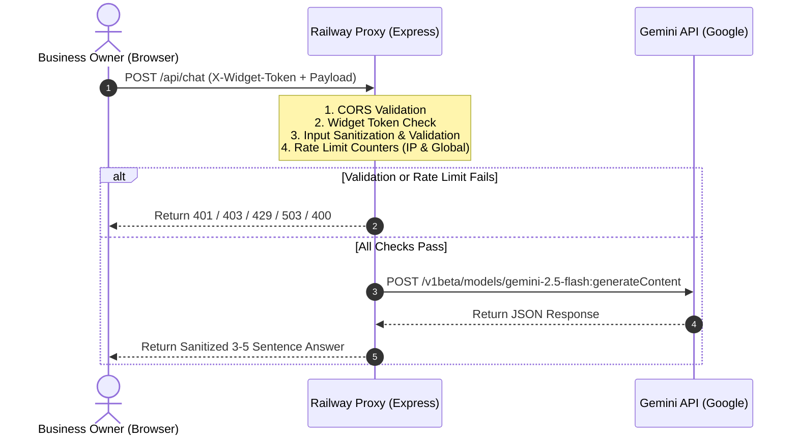

# Technical Implementation Plan: FAQ Chat Agent

This implementation plan details the technical architecture, security measures, and development guidelines for the FAQ Chat Agent feature. It aligns with the constraints defined in the **FAQ Chat Agent Swarm Constitution**.

---

## 1. System Architecture

The FAQ Chat Agent system consists of two primary components:
1. **Frontend Chat Widget**: A lightweight, self-contained HTML/CSS/Vanilla JS component embedded in the portfolio website. It handles UI states, user input sanitization, and session-based history.
2. **Backend Proxy Server**: An Express.js application hosted on Railway. It intercepts client requests, performs validation, rate limiting, and forwards inquiries securely to the Gemini API using native `fetch`.



---

## 2. Technology Stack & Model Choice

- **Backend**:
  - **Runtime**: Node.js (v18+)
  - **Framework**: Express.js
  - **HTTP Requests**: Native `fetch` (utilizing `AbortController` for timeouts as mandated by the constitution).
- **LLM Model**:
  - **Choice**: `gemini-2.5-flash`
  - **Rationale**: Ultra-fast execution, cost-effective, high reasoning efficiency for structured FAQ QA, and low latency ensuring response times under 3 seconds (SC-001).
- **Frontend**:
  - **Languages**: HTML5, CSS3, Vanilla JavaScript (no external frameworks like React/Vue to maintain absolute simplicity and fast load times on the static portfolio site).
  - **Storage**: `sessionStorage` for persisting selected language across internal page navigation.

---

## 3. Data Models & API Payloads

### 3.1 Client to Proxy (`POST /api/chat`)
**Headers**:
- `Content-Type: application/json`
- `X-Widget-Token: <SECRET_WIDGET_TOKEN>`

**Request Body**:
```json
{
  "message": "Wer bist du?",
  "lang": "de",
  "history": [
    {"role": "user", "parts": [{"text": "Hello"}]},
    {"role": "model", "parts": [{"text": "Hello, I am Mikhail's assistant. How can I help you today?"}]}
  ]
}
```

### 3.2 Proxy to Gemini API (`POST https://generativelanguage.googleapis.com/...`)
The proxy reformulates the payload into the Gemini API format, appending system instructions and the custom Knowledge Base.

**Query Parameter**: `?key=GEMINI_API_KEY`
**Body**:
```json
{
  "contents": [
    {
      "role": "user",
      "parts": [{"text": "<System Instructions & Knowledge Base>\n\nHistory:\n..."}]
    }
  ],
  "generationConfig": {
    "temperature": 0.3,
    "maxOutputTokens": 200
  }
}
```

---

## 4. Security & Privacy Implementation

### 4.1 CORS Whitelisting
Configure Express CORS middleware to restrict traffic:
- **Production Mode**: Allow only `https://azhyshchev.de`. Return `403 Forbidden` for all other origins.
- **Development Mode**: Allow `http://localhost:5500` (controlled via `NODE_ENV` environment variable).

### 4.2 Widget Token Authentication
- A static token `SECRET_WIDGET_TOKEN` is generated and saved as an environment variable in Railway.
- The frontend widget includes this token in the `X-Widget-Token` header.
- The backend checks `req.headers['x-widget-token'] === process.env.SECRET_WIDGET_TOKEN`. If not, returns `401 Unauthorized`.

### 4.3 Two-Tier Rate Limiting (In-Memory)
A custom middleware stores request counters in memory to enforce the limits:
1. **IP-Based Limit**:
   - Check request origin IP.
   - Max 25 requests per IP in a rolling 24-hour window.
   - Return `429 Too Many Requests` on violation.
2. **Global Daily Cap**:
   - Rolling total counter across all IPs.
   - Max 300 requests in a rolling 24-hour window.
   - Return `503 Service Unavailable` on violation.

```javascript
// Custom In-Memory Rate Limiter Logic
const ipHistory = new Map(); // ip -> Array of timestamps
const globalHistory = []; // Array of timestamps

function rateLimiter(req, res, next) {
  const ip = req.ip || req.headers['x-forwarded-for'];
  const now = Date.now();
  const oneDay = 24 * 60 * 60 * 1000;

  // Clean old entries from global history
  while (globalHistory.length > 0 && globalHistory[0] < now - oneDay) {
    globalHistory.shift();
  }

  // Check global limit
  if (globalHistory.length >= 300) {
    return res.status(503).json({ error: "Service temporarily unavailable due to high traffic. Please contact azhyshchev@gmail.com." });
  }

  // Get and clean IP history
  let timestamps = ipHistory.get(ip) || [];
  timestamps = timestamps.filter(t => t > now - oneDay);
  ipHistory.set(ip, timestamps);

  // Check IP limit
  if (timestamps.length >= 25) {
    return res.status(429).json({ error: "Daily limit exceeded. Please contact azhyshchev@gmail.com directly." });
  }

  // Record request
  timestamps.push(now);
  globalHistory.push(now);
  next();
}
```

### 4.4 Input Sanitization & Validation
- **Length Verification**:
  - `message` must be a string <= 500 characters.
  - `lang` must be exactly `"de"` or `"en"`.
  - `history` array must have a length <= 8, and each history text must be <= 500 characters.
- **Sanitization**:
  - Strip all HTML tags using a regular expression: `str.replace(/<[^>]*>/g, '')`.
  - Return `400 Bad Request` if payload validation fails.

---

## 5. System Prompt & Knowledge Base Integration

The system prompt is appended to the request when querying Gemini. It acts as the system instruction.

### 5.1 System Instruction Content
- **Persona**: You are the professional, friendly, and efficient virtual assistant for Mikhail Azhyshchev, an AI Automation Engineer based in Munich.
- **Rules**:
  - Speak in the user's selected language (`de` or `en`).
  - Answer questions based *strictly* on the provided FAQ database.
  - If a question is outside the scope of Mikhail's services (e.g., general programming, news, weather), politely decline and offer to help with automation.
  - For projects or scoping questions, transition to **Intake Mode**: Ask 2-3 short clarifying questions (industry, process, volume, tools) and ask for their email. DO NOT provide price estimates.
  - Keep responses concise (3-5 sentences).
  - Every closing reply must include a clear, non-mandatory call-to-action (e.g., booking a 15-minute call, emailing `azhyshchev@gmail.com`, or providing details in chat).

---

## 6. Directory Structure

```
portfolio/
├── .specify/
│   └── memory/
│       └── constitution.md     # Swarm Constitution
├── specs/
│   └── faq-chat-agent/
│       ├── spec.md             # Functional Spec
│       ├── plan.md             # Implementation Plan (This File)
│       └── tasks.md            # Actionable Task List
├── backend/                    # Railway Express App
│   ├── .env.example            # Environment variables template
│   ├── .gitignore              # Ignore node_modules, .env
│   ├── package.json            # npm package definition
│   ├── server.js               # Express application entrypoint
│   └── README.md               # Deploy instructions
└── public/                     # Static website root
    ├── index.html              # Main website file
    ├── css/
    │   └── chat-widget.css     # CSS stylesheet for chatbot UI
    └── js/
        └── chat-widget.js      # Widget logic (sanitization, API calls, state)
```

---

## 7. Verification & Testing Strategy

- **CORS Testing**: Use `curl -H "Origin: https://malicious.com"` to verify the proxy responds with `403 Forbidden`.
- **Token Verification**: Verify that a request without `X-Widget-Token` or with an invalid token returns `401 Unauthorized`.
- **Rate Limit Testing**: Execute a script simulating 26 requests from a single IP to confirm the 26th request receives `429 Too Many Requests`. Simulate 301 global requests to confirm the 301st returns `503 Service Unavailable`.
- **Validation Testing**: Send messages with HTML tags (e.g. `<b>test</b>`) or strings over 500 characters and verify the system handles or rejects them cleanly.
- **TDD / Mocking**: Create mock tests for the backend proxy logic to verify prompt assembly and safety layers without consuming Gemini API tokens.
